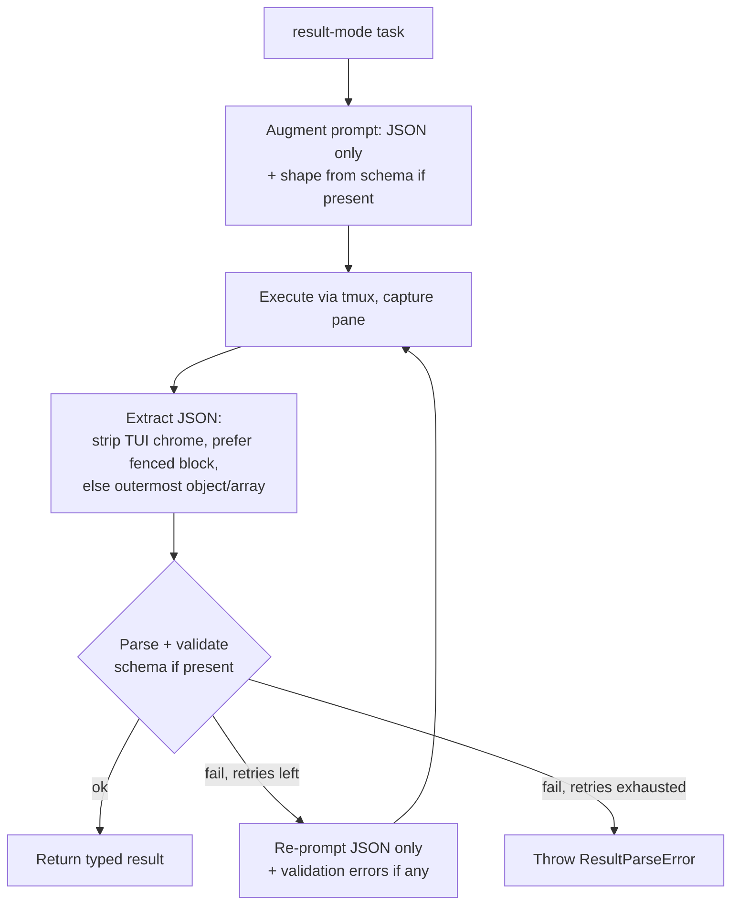

# Integration Test Suite & Reliable Result-Mode JSON

## Summary

Add a real, locally-gated tmux + Claude integration suite covering four scenarios (one-shot, plain text, JSON, controlled high-concurrency), and overhaul result mode so JSON output is actually reliable end-to-end — internally coaxed, extracted, retried, and (optionally) Zod-validated and typed — without adding any bundled production dependency.

---

## Problem Frame

The integration layer is currently a stub. `test/integration/real-tmux.skip-safe.test.ts` only checks that `tmux` and `claude` are on `$PATH`, then asserts nothing about behavior. All real coverage runs through `FakeTmux` / `FakeClaude`, which return clean, pre-shaped data and therefore hide the class of bugs that only the real adapter exhibits.

The sharpest example is result mode, which is effectively broken against real tmux. `parseResultIfNeeded` in `src/sdk.ts` runs `JSON.parse` on the output returned by `RealTmuxAdapter.execute` (`src/tmux-adapter.ts`) — and that output is the **entire captured pane**: TUI chrome, the prompt echo, status lines like `✻ Baked`. Parsing that blob almost always throws `ResultParseError`. The fakes feed a clean `result`, so unit tests stay green while the real path cannot return JSON at all.

Two gaps follow. Without real integration tests, adapter-only failures ship silently. And without SDK-side JSON handling, the JSON scenario could not pass even after the tests exist — the test would correctly fail on day one.

---

## Key Decisions

- **Integration tests are opt-in, not part of the default test run.** Real Claude is slow, costs tokens, and needs authentication. Gating them behind a dedicated command plus an env flag keeps `pnpm test` fast and fake-only, while still giving a real-chain smoke layer on demand.

- **JSON correctness becomes the SDK's responsibility, not the user's prompt.** Today the user must hand-write "return only JSON" instructions and hope the pane parses. Instead the SDK coaxes, extracts, and retries internally so callers describe *what data* they want, not *how to format it*.

- **Optional Zod schema does triple duty; Zod is never bundled.** A schema (when supplied) shapes the prompt, enforces the result at runtime, and types the return via `z.infer`. Zod stays a peer/optional dependency and the no-schema path needs it not at all — so a default install keeps the project's "zero production dependencies" promise intact.

- **Two coverage layers, by what each can catch.** The new pure logic (extraction, retry control flow, schema validation) gets fast fake-based unit tests that run in CI; the real tmux/Claude chain gets the local integration suite. CI guards regressions the gated suite can't.

- **Strong concurrency assertion.** The high-concurrency test verifies the cap is both respected and reached (peak simultaneous running `== 3`), not merely "≤ 3". Real-Claude latency makes the peak stable to observe.

- **Repair retry defaults to 3.** A stubborn result task makes up to four executions total before raising. Accepted as the robustness/latency trade-off.

---

## Requirements

### Integration test suite

R1. Replace the availability-only stub in `test/integration/` with real end-to-end tests that drive real tmux + real Claude and assert behavior.

R2. Gate behind explicit opt-in: a dedicated command (e.g. `pnpm test:integration`) plus an env flag (e.g. `RUN_INTEGRATION=1`). The default `pnpm test` stays fast, fake-only, and never invokes Claude.

R3. Remain skip-safe even under opt-in: if `tmux` or the Claude CLI is unavailable, skip cleanly rather than fail.

R4. one-shot scenario — `runOneShot(prompt)` returns a non-empty text `.output`.

R5. plain-text scenario — `runTask({ mode: "oneshot" })` returns text via `.output`; exercises the full-API text path, distinct from R4's shortcut.

R6. JSON scenario — `runTask({ mode: "result", schema })` returns a parsed, schema-validated object; assert both the shape and a computable known value (e.g. a `sum` field that must equal `4`).

R7. controlled-concurrency scenario — with `poolSize: 3` and 10 tasks submitted simultaneously, the peak number running at once is exactly 3, queueing is observed, and all 10 succeed.

R8. Each test isolates its tmux sessions (unique `sessionPrefix`) and tears them down via `cleanup()`; per-test timeouts accommodate real-Claude latency.

R9. Assertion discipline — constrained prompts with property/value assertions (non-empty, contains a known token, schema-valid, known computable values). No exact-equality on free-form model text.

### Result-mode JSON reliability

R10. In result mode the SDK augments the prompt to force a single valid JSON value (no code fences, no prose), transparently. The oneshot/text path is unaffected.

R11. Before parsing, the SDK extracts JSON from the noisy pane capture: strip terminal/TUI chrome, prefer a fenced ` ```json ` block, otherwise take the outermost balanced object/array.

R12. On parse or validation failure the SDK re-prompts for JSON-only output — default 3 retries (initial attempt + up to 3 re-prompts = up to 4 executions). Exhausting retries raises `ResultParseError`.

### Optional Zod schema validation

R13. `runTask({ mode: "result", schema })` accepts an optional Zod schema. Absent → generic JSON behavior (R10–R12 with an "is valid JSON" check). Present → the schema drives prompt, validation, and typing.

R14. When a schema is present it does triple duty: shapes the JSON-only prompt, enforces the parsed result at runtime, and types the return via `z.infer`.

R15. When schema validation fails, the repair re-prompt (R12) includes the specific validation errors so the next attempt is corrective, not blind.

R16. Zod is a peer/optional dependency, never bundled. The no-schema path requires no Zod, so a default install keeps zero production dependencies.

### CI unit coverage

R17. Fake-based unit tests cover the new pure logic — extraction over recorded noisy pane samples, retry control flow (fail-then-succeed and fail-through-to-error), and schema validation (valid/invalid payloads) — runnable in CI without tmux or Claude.

---

## Result-mode JSON pipeline

The flow below illustrates R10–R15. The prose requirements remain the source of truth; the diagram is an on-ramp.



---

## Acceptance Examples

AE1. **Covers R7.** **Given** `poolSize: 3` and 10 tasks submitted at once, **When** they are dispatched, **Then** at no point do more than 3 run simultaneously, the peak reaches exactly 3, at least 7 tasks emit a queued event, and all 10 complete successfully.

AE2. **Covers R12.** **Given** Claude's first reply wraps JSON in prose or fences such that extraction-or-validation fails, **When** the SDK retries, **Then** it re-prompts (up to 3 times) and returns the validated object as soon as any attempt yields valid JSON.

AE3. **Covers R12.** **Given** all four attempts fail to produce extractable/valid JSON, **When** retries are exhausted, **Then** the SDK raises `ResultParseError`.

AE4. **Covers R13, R14.** **Given** `mode: "result"` with a schema, **Then** the result is runtime-validated and typed via `z.infer`. **Given** no schema, **Then** the SDK only checks that the output is valid JSON and returns it untyped.

AE5. **Covers R2, R3.** **Given** the opt-in env flag is unset, **When** `pnpm test` runs, **Then** the integration tests do not execute. **Given** the flag is set but `tmux`/`claude` are absent, **Then** they skip cleanly rather than fail.

---

## Scope Boundaries

- Running the real-Claude integration suite in CI — it needs Claude authentication and is local-only by design.
- Bundling Zod (or any validator) as a production dependency — peer/optional only.
- Changing the tmux execution or container/consumer model.
- Structured/JSON streaming — streaming stays plain-text.
- JSON coaxing/validation for non-result modes.

---

## Dependencies / Assumptions

- The schema path assumes Zod is available as a peer/optional dependency; consumers opt in by installing it.
- The integration suite assumes a locally authenticated Claude CLI and `tmux` in `$PATH`; it is a local confidence/smoke layer, not a CI gate.
- Retry default is 3 re-prompts (up to 4 executions); worst-case ~4× latency on a stubborn result task is accepted.
- Real-Claude output is non-deterministic; assertions rely on constrained prompts plus shape/known-value checks, never exact text.

---

## Outstanding Questions

### Deferred to Planning

- Where prompt augmentation and extraction live (SDK core vs `RealTmuxAdapter`), given extraction must cope with adapter-specific pane noise.
- Exact repair re-prompt wording and how validation errors are formatted into it.
- How the optional `schema` integrates with the existing `runTask<T>` generic (`z.infer` inference vs explicit `T`).
- vitest configuration for a separate integration project/command and timeout tuning.
- Whether the retry count should later become configurable (currently a fixed default of 3).
