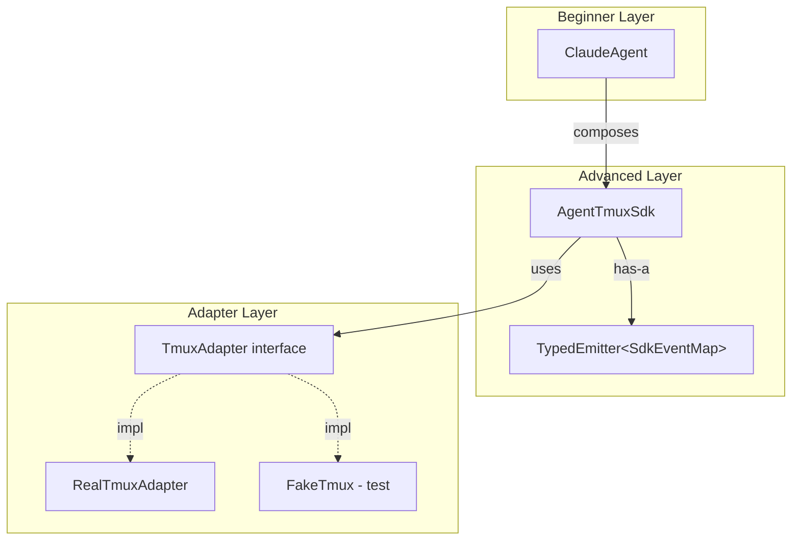
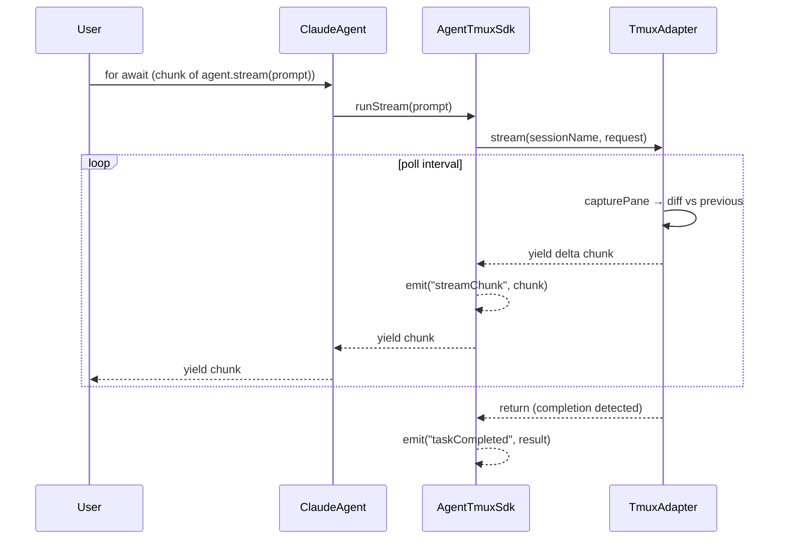

# refactor: Layered API, streaming, events, and account removal

## Summary

Restructure the agent-tmux-sdk public API into two layers: a beginner-friendly `ClaudeAgent` for CI/CD script integration and the existing `AgentTmuxSdk` for advanced users. Add streaming output (`AsyncIterable<string>`) and a typed lifecycle event system. Remove all account management code. Tighten the public API contract to reduce future breaking changes.

---

## Problem Frame

The SDK currently exposes a flat API surface that requires users to understand tmux sessions, process pools, slot lifecycles, and task modes before they can run a single prompt. The `ClaudeAgent` class exists as a convenience wrapper but is only 3 lines and provides no real value. Meanwhile, account management features (`switchAccount`, `account` option) are exported despite being outside this SDK's responsibility — Claude CLI handles accounts directly. These issues create unnecessary learning curve, API instability risk, and maintenance burden.

---

## Requirements

From origin (see `docs/brainstorms/2026-06-09-api-restructure-requirements.md`):

- **R1**: Redesign `ClaudeAgent` as the beginner entry point with `run()`, `stream()`, simple options, and auto-cleanup
- **R2**: Streamline `AgentTmuxSdk` by removing account-related fields and methods
- **R3**: Streaming output via `AsyncIterable<string>` at both API layers
- **R4**: Typed lifecycle event system (taskQueued, taskStarted, taskCompleted, taskFailed, taskResuming, processStarted, processStopped, processError, streamChunk)
- **R5**: Complete removal of account management code, tests, and examples
- **R6**: Public API contract audit — hide internal types, narrow exports
- **R7**: Test hardening — fake/real parity, new feature coverage, edge cases

**Success criteria**: beginner achieves prompt→result in 3 lines; advanced users retain current control (minus account); zero new production dependencies; test coverage does not regress.

---

## Key Technical Decisions

**KTD-1: Typed event emitter via Node.js `EventEmitter` with generic wrapper.**
Use Node.js built-in `events` module (zero-dependency) wrapped in a generic `TypedEmitter<EventMap>` class that provides compile-time type safety for event names and payloads. This avoids reinventing event infrastructure while keeping strict types. The wrapper is ~20 lines. The SDK class composes (has-a) the emitter rather than extending it, keeping the public API clean.

**KTD-2: Streaming via `capturePane` incremental diff.**
The existing `RealTmuxAdapter.waitForCompletion` already polls `capturePane` at configurable intervals. Streaming layers an incremental diff on top — each poll compares the new capture against the previous, yields the delta as a chunk. Streaming fidelity is bounded by poll interval and tmux pane buffer size. This is a fundamental limitation of the tmux-based model and is acceptable. The `TmuxAdapter` interface gains a `stream()` method returning `AsyncIterable<string>`.

**KTD-3: `ClaudeAgent` auto-cleanup via `Symbol.asyncDispose` + process exit fallback.**
The project requires Node.js ≥ 20 and TypeScript ≥ 5.8. `Symbol.asyncDispose` is available in Node.js 20.4+ (behind flag) and stable in 22+. Implementation: always register a `process.on('exit')` handler as fallback cleanup; additionally implement `[Symbol.asyncDispose]()` when the symbol exists so `await using agent = new ClaudeAgent()` works where supported. Add `"esnext.disposable"` to `tsconfig.json` `lib` array for the type definitions.

**KTD-4: Event subscription is opt-in; no performance cost when unused.**
Events are emitted via the typed emitter only when listeners are registered. The emitter's `emit()` is a no-op when `listenerCount === 0`, so there is no overhead for users who don't subscribe.

---

## High-Level Technical Design

### Layered Architecture



`ClaudeAgent` composes `AgentTmuxSdk` internally, exposing only `run()` and `stream()`. The SDK holds a `TypedEmitter` for lifecycle events. The `TmuxAdapter` interface gains `stream()` alongside the existing `execute()`.

### Streaming Sequence



### Event Map

```typescript
// Directional — exact names/shapes resolved at implementation
interface SdkEventMap {
  taskQueued:     [snapshot: TaskSnapshot]
  taskStarted:    [snapshot: TaskSnapshot]
  taskCompleted:  [result: TaskResult]
  taskFailed:     [taskId: string, error: Error]
  taskResuming:   [taskId: string, attempt: number]
  processStarted: [processId: string]
  processStopped: [processId: string]
  processError:   [processId: string, error: Error]
  streamChunk:    [taskId: string, chunk: string]
}
```

---

## Scope Boundaries

### In scope
- Account removal from all source, tests, fakes, and examples
- Typed event system and streaming output
- `ClaudeAgent` redesign with auto-cleanup
- Public export audit
- Test hardening for all changed and new code
- Example reorganization and renumbering

### Deferred to Follow-Up Work
- Claude CLI version detection or compatibility layer
- Multi-model support (passing `model` option to Claude CLI)
- Persistent task history or result caching
- WebSocket or HTTP-based adapter alternatives to tmux

### Outside this SDK's identity
- Claude account management (login, switching, authentication)
- Claude CLI installation or updates
- tmux installation or configuration

---

## Implementation Units

### U1. Remove account from types and interfaces

**Goal:** Strip all account-related fields from type definitions and the `TmuxAdapter` interface.

**Requirements:** R5

**Dependencies:** None

**Files:**
- `src/types.ts` (modify)

**Approach:**
- Remove `account?: string` from `AgentTmuxSdkOptions`
- Remove `account?: string` from `ClaudeStartOptions`
- Remove `account?: string` from `ClaudeExecutionRequest`
- Remove `account?: string` from `ProcessSnapshot`
- Remove `switchAccount(sessionName: string, account: string): Promise<void>` from `TmuxAdapter` interface

**Patterns to follow:** Existing readonly field conventions in `types.ts`.

**Test scenarios:**
- Type compilation succeeds without account fields
- `TmuxAdapter` implementations no longer require `switchAccount`

---

### U2. Remove account from SDK and adapter implementation

**Goal:** Remove all account management logic from `AgentTmuxSdk` and `RealTmuxAdapter`.

**Requirements:** R2, R5

**Dependencies:** U1

**Files:**
- `src/sdk.ts` (modify)
- `src/tmux-adapter.ts` (modify)
- `src/index.ts` (modify — remove re-export if needed)

**Approach:**
In `sdk.ts`:
- Remove `desiredAccount` field
- Remove `switchAccount()` public method
- Remove `applyAccount()` private method
- Remove account references from `constructor`, `acquireSlot`, `claudeStartOpts`, `toRequest`

In `tmux-adapter.ts`:
- Remove `switchAccount()` method
- Remove account parameter handling from `startClaude()`

**Patterns to follow:** Current error handling patterns in `sdk.ts`.

**Test scenarios:**
- SDK constructs without `account` option
- `runOneShot` and `runTask` work without account threading
- `getProcesses()` snapshots have no `account` field
- `claudeStartOpts()` produces options without `account`

---

### U3. Remove account from tests, fakes, and examples

**Goal:** Clean all account references from test infrastructure, test files, and examples. Delete dedicated account files.

**Requirements:** R5

**Dependencies:** U2

**Files:**
- `test/account-switching.test.ts` (delete)
- `test/fakes/fake-tmux.ts` (modify)
- `test/fake-harness.test.ts` (modify)
- `test/lifecycle.test.ts` (modify)
- `test/public-api-types.test.ts` (modify)
- `examples/05-account-switching.ts` (delete)
- `examples/03-process-pool.ts` (modify)
- `examples/08-error-handling.ts` (modify)
- `examples/10-claude-agent.ts` (modify)
- `examples/11-custom-adapter.ts` (modify)

**Approach:**
In `fake-tmux.ts`:
- Remove `accountSwitches` array
- Remove `failAccountSwitch` flag
- Remove `switchAccount()` method

In test files:
- `fake-harness.test.ts`: remove `switchAccount` call, `accountSwitches` assertion, `failAccountSwitch` flag test
- `lifecycle.test.ts`: remove `account: "test-acct"` from constructor, remove `account` assertion from snapshot test
- `public-api-types.test.ts`: remove `account: "work"` from options, remove `ClaudeSessionId` type test if it will be hidden (defer to U9)

In examples:
- `03-process-pool.ts`: remove `account` from console.log
- `08-error-handling.ts`: remove account switch comment
- `10-claude-agent.ts`: remove `account: "work"` option
- `11-custom-adapter.ts`: remove `switchAccount` from custom adapter

**Patterns to follow:** Existing test structure with `FakeTmux` and `describe/it` blocks.

**Test scenarios:**
- All existing tests pass after account removal (minus the deleted test file)
- `FakeTmux` implements `TmuxAdapter` without `switchAccount`
- `pnpm run typecheck` passes cleanly

---

### U4. Create typed event system

**Goal:** Implement a zero-dependency typed event emitter and define the SDK event map.

**Requirements:** R4

**Dependencies:** None (can proceed in parallel with U1–U3)

**Files:**
- `src/events.ts` (create)
- `src/types.ts` (modify — add event payload types)

**Approach:**
Create a generic `TypedEmitter<T extends Record<string, unknown[]>>` class wrapping Node.js `EventEmitter`:
- `on<K>(event: K, listener: (...args: T[K]) => void): this`
- `off<K>(event: K, listener: (...args: T[K]) => void): this`
- `once<K>(event: K, listener: (...args: T[K]) => void): this`
- `emit<K>(event: K, ...args: T[K]): boolean`
- `listenerCount<K>(event: K): number`
- `removeAllListeners(event?: K): this`

Define `SdkEventMap` in `types.ts` mapping event names to typed tuples. Export the map type and individual event payload types for consumer use.

**Patterns to follow:** Node.js `EventEmitter` API surface. Keep the wrapper minimal — no custom features beyond type safety.

**Test scenarios:**
- Emitting a known event calls registered listeners with correct typed arguments
- `off()` removes a listener; it no longer fires
- `once()` fires exactly once
- `emit()` with no listeners returns false and causes no error
- `removeAllListeners()` clears all subscriptions
- `listenerCount()` returns accurate count
- TypeScript compilation rejects misspelled event names or wrong payload types (type-level test)

**Test file:** `test/events.test.ts`

---

### U5. Integrate events into AgentTmuxSdk

**Goal:** Wire the event emitter into the SDK lifecycle so external consumers can subscribe.

**Requirements:** R4

**Dependencies:** U4

**Files:**
- `src/sdk.ts` (modify)
- `src/types.ts` (modify — add events option to `AgentTmuxSdkOptions`)

**Approach:**
- Add a `TypedEmitter<SdkEventMap>` instance to `AgentTmuxSdk`
- Expose `on()`, `off()`, `once()` as public methods that delegate to the emitter (composition, not inheritance)
- Emit at lifecycle points:
  - `taskQueued` — when task enters queue in `runTask()`
  - `taskStarted` — when task state becomes `"running"` in `executeTask()`
  - `taskCompleted` — when task resolves successfully
  - `taskFailed` — when task rejects
  - `taskResuming` — when token exhaustion triggers resume in `executeWithResume()`
  - `processStarted` — when `startSlot()` completes
  - `processStopped` — in `cleanup()` after killing session
  - `processError` — when slot enters `"failed"` state

**Patterns to follow:** Current lifecycle state transitions in `sdk.ts`. Emit events at the same points where state transitions happen.

**Test scenarios:**
- `taskQueued` fires when a task is submitted
- `taskStarted` fires when a task begins execution
- `taskCompleted` fires with the `TaskResult` on success
- `taskFailed` fires with the task ID and error on failure
- `taskResuming` fires with attempt number during token-exhaustion recovery
- `processStarted` fires when a new tmux slot is created
- `processStopped` fires during cleanup
- `processError` fires when a slot startup fails
- Events fire in correct lifecycle order: queued → started → completed/failed
- No events fire when no listeners are registered (performance: verify no side effects)
- Multiple listeners on the same event all receive the payload
- Events are observable across concurrent tasks in a multi-slot pool

**Test file:** `test/sdk-events.test.ts`

---

### U6. Add streaming to TmuxAdapter

**Goal:** Extend the `TmuxAdapter` interface with a streaming execution method and implement it in both `RealTmuxAdapter` and `FakeTmux`.

**Requirements:** R3

**Dependencies:** U1–U3 (clean adapter interface first)

**Files:**
- `src/types.ts` (modify — add `stream` to `TmuxAdapter`)
- `src/tmux-adapter.ts` (modify — implement `stream()`)
- `test/fakes/fake-tmux.ts` (modify — implement `stream()`)

**Approach:**
Add to `TmuxAdapter`:
```
stream(sessionName: string, request: ClaudeExecutionRequest): AsyncIterable<string>
```

In `RealTmuxAdapter`:
- Implement as an `async function*` that polls `capturePane` at `pollIntervalMs`
- Track previous capture; yield only the new delta on each poll
- Detect completion using the existing `isResponseComplete` / stable-threshold logic
- On completion, yield any remaining delta and return

In `FakeTmux`:
- Accept configurable streaming chunks via `FakeClaude`
- Add a `streamChunks` behavior type to `FakeClaudeBehavior` that yields predefined chunks with optional delays

**Patterns to follow:** `waitForCompletion()` polling loop in `tmux-adapter.ts`. The `FakeClaudeBehavior` discriminated union pattern in `fake-claude.ts`.

**Test scenarios:**
- `RealTmuxAdapter.stream()` yields incremental chunks (tested indirectly via `FakeTmux` at SDK level)
- `FakeTmux.stream()` yields configured chunks in order
- Empty delta polls are not yielded (no empty strings in the iterable)
- Completion is detected and the iterable terminates
- Streaming respects `workingDirectory` in the request

**Test file:** `test/streaming.test.ts`

---

### U7. Add streaming to AgentTmuxSdk

**Goal:** Expose streaming at the SDK level, integrating with the event system.

**Requirements:** R3, R4

**Dependencies:** U5, U6

**Files:**
- `src/sdk.ts` (modify — add `runStream()`)
- `src/types.ts` (modify — add `RunStreamOptions` if needed)

**Approach:**
Add `runStream(prompt: string, options?): AsyncIterable<string>` to `AgentTmuxSdk`:
- Acquires a slot (same pool logic as `runTask`)
- Calls `this.tmux.stream(sessionName, request)` on the adapter
- Wraps the adapter's iterable to emit `streamChunk` events for each chunk
- On completion, constructs a `TaskResult` and emits `taskCompleted`
- On error, emits `taskFailed`
- Respects task timeout via `AbortController` or race pattern

The method is an `async function*` that yields chunks from the adapter stream.

**Patterns to follow:** `executeTask()` lifecycle in `sdk.ts` for slot acquisition, state management, and cleanup.

**Test scenarios:**
- `runStream()` yields all chunks from the adapter in order
- `streamChunk` event fires for each yielded chunk
- `taskStarted` and `taskCompleted` events fire around the stream
- Task timeout aborts the stream and throws `TaskTimeoutError`
- Slot is returned to idle after streaming completes
- Slot is returned to idle after streaming errors
- Concurrent streams on a multi-slot pool work independently
- Breaking out of the `for await` loop early cleans up the slot

**Test file:** `test/streaming.test.ts` (extend from U6)

---

### U8. Redesign ClaudeAgent as beginner entry point

**Goal:** Transform `ClaudeAgent` from a 3-line wrapper into a self-contained beginner API with `run()`, `stream()`, and auto-cleanup.

**Requirements:** R1

**Dependencies:** U5, U7

**Files:**
- `src/claude-agent.ts` (modify)
- `src/types.ts` (modify — add `ClaudeAgentOptions`)
- `tsconfig.json` (modify — add `"esnext.disposable"` to `lib`)

**Approach:**
Define `ClaudeAgentOptions`:
- `workingDirectory?: string`
- `timeoutMs?: number`
- `dangerouslySkipPermissions?: boolean` (default `true`, matching current SDK default)

`ClaudeAgent` class:
- Constructor creates an internal `AgentTmuxSdk` with `poolSize: 1` and sensible defaults
- `run(prompt: string): Promise<string>` — runs one-shot, returns output string directly (not `TaskResult`)
- `stream(prompt: string): AsyncIterable<string>` — delegates to SDK `runStream()`
- `[Symbol.asyncDispose]()` — calls `this.sdk.cleanup()` for `await using` support
- `cleanup()` — explicit cleanup for environments without `using`
- Registers `process.on('beforeExit')` handler as fallback auto-cleanup

Design choices:
- `run()` returns `string`, not `TaskResult` — beginners want the answer, not metadata
- No `poolSize`, `idleRestartMs`, `resumeAttempts`, `sessionPrefix`, or `tmux` options — those are advanced
- No `mode` parameter — always oneshot. Result mode is an advanced concept

**Patterns to follow:** Current `ClaudeAgent` delegation pattern, extended.

**Test scenarios:**
- `run(prompt)` returns the output string directly
- `stream(prompt)` yields chunks as `AsyncIterable<string>`
- Constructor accepts only beginner-level options
- `workingDirectory` is forwarded to the underlying SDK
- `timeoutMs` is forwarded and causes `TaskTimeoutError` on expiry
- `cleanup()` stops the underlying tmux session
- `Symbol.asyncDispose` calls cleanup (when symbol is available)
- Multiple sequential `run()` calls reuse the same tmux session
- `run()` after `cleanup()` throws a clear error
- Default options produce a working agent without any configuration

**Test file:** `test/claude-agent.test.ts` (rewrite existing)

---

### U9. Tighten public API exports

**Goal:** Audit and narrow `src/index.ts` to export only what users need at each layer.

**Requirements:** R6

**Dependencies:** U4, U5, U7, U8

**Files:**
- `src/index.ts` (modify)
- `test/public-api-types.test.ts` (modify)

**Approach:**
Beginner exports (what `ClaudeAgent` users need):
- `ClaudeAgent`
- `ClaudeAgentOptions`
- `AgentTmuxSdkError`, `AgentTaskError`, `TaskTimeoutError`, `ResultParseError`, `TmuxError`

Advanced exports (additional for `AgentTmuxSdk` users):
- `AgentTmuxSdk`
- `AgentTmuxSdkOptions`, `RunTaskOptions`, `RunOneShotOptions`
- `TaskResult`, `TaskSnapshot`, `TaskState`, `TaskMode`
- `ProcessSnapshot`, `ProcessState`
- `SdkEventMap` (for typed event subscriptions)
- `TmuxAdapter`, `TmuxProcessHandle`, `RealTmuxAdapter`, `RealTmuxAdapterOptions`
- `ClaudeStartOptions`, `ClaudeExecutionRequest`, `ClaudeExecutionResult`
- `DEFAULT_IDLE_RESTART_MS`

Remove from public exports:
- `ClaudeSessionId` — internal concept, opaque to users. The type is `string` so it leaks nothing, but exporting it implies it's part of the API contract

**Patterns to follow:** Current barrel export pattern in `index.ts`.

**Test scenarios:**
- Type test: `ClaudeAgent` is importable and constructible with `ClaudeAgentOptions`
- Type test: `AgentTmuxSdk` is importable with `AgentTmuxSdkOptions`
- Type test: all error classes are importable and `instanceof`-checkable
- Type test: `SdkEventMap` is importable for typed `on()` callbacks
- Type test: `ClaudeSessionId` is NOT exported (compilation failure if imported)
- All existing consumer patterns still compile

**Test file:** `test/public-api-types.test.ts` (rewrite)

---

### U10. Reorganize and add examples

**Goal:** Renumber examples after account deletion, reorder beginner-first, and add examples for new features.

**Requirements:** R1, R3, R4

**Dependencies:** U8, U9

**Files:**
- `examples/01-basic-oneshot.ts` (modify — use `ClaudeAgent` instead of `AgentTmuxSdk`)
- `examples/02-streaming.ts` (create — `ClaudeAgent.stream()`)
- `examples/03-timeout.ts` (rename from `04-task-timeout.ts`, use `ClaudeAgent`)
- `examples/04-error-handling.ts` (rename from `08-error-handling.ts`, use `ClaudeAgent`)
- `examples/05-process-pool.ts` (rename from `03-process-pool.ts`)
- `examples/06-result-mode.ts` (rename from `02-result-mode.ts`)
- `examples/07-token-resume.ts` (rename from `07-token-exhaustion.ts`)
- `examples/08-idle-restart.ts` (rename from `06-idle-restart.ts`)
- `examples/09-task-metadata.ts` (keep `09`)
- `examples/10-lifecycle-events.ts` (create — event system demo)
- `examples/11-custom-adapter.ts` (keep number, clean account code)
- `examples/12-graceful-shutdown.ts` (keep number)
- Delete: `examples/05-account-switching.ts` (done in U3)
- Delete: old numbered files that were renamed

**Approach:**
- Examples 01–04: beginner tier using `ClaudeAgent`
- Examples 05–12: advanced tier using `AgentTmuxSdk`
- New streaming example shows `for await (const chunk of agent.stream(prompt))`
- New events example shows `sdk.on('taskCompleted', ...)` pattern
- All examples should be self-contained and runnable

**Test expectation:** none — examples are not executed in CI

---

## Open Questions

- **Streaming chunk granularity**: tmux `capture-pane` returns the full visible pane, and diffing produces line-level or character-level deltas. The exact diff strategy (line-based vs character-based) should be resolved during implementation when the actual pane output can be observed. Line-based is simpler and likely sufficient.

- **`process.beforeExit` cleanup reliability**: In some Node.js scenarios (e.g., `process.exit(1)` called directly), `beforeExit` doesn't fire. The docs should note that `cleanup()` or `await using` is preferred and the process handler is a best-effort fallback.

---

## Risks & Dependencies

| Risk | Impact | Mitigation |
|------|--------|------------|
| Streaming fidelity limited by tmux pane buffer | Users may miss output that scrolls past the buffer | Document the limitation; recommend increasing tmux `history-limit` for long outputs |
| `Symbol.asyncDispose` not available in Node.js 20 without flags | `await using` pattern doesn't work on older Node 20.x | Always provide explicit `cleanup()` method; `asyncDispose` is opt-in sugar |
| Breaking change for existing consumers using `account` option | Compilation error on upgrade | This is v0.1.0 (pre-1.0), breaking changes are expected. Document in CHANGELOG |
| Event emission adding overhead to hot path | Performance regression for users who don't use events | `emit()` is no-op when `listenerCount === 0`; validated by KTD-4 |

---

## Sources & Research

- Node.js `EventEmitter` API: built-in, zero-dependency event infrastructure
- TypeScript `esnext.disposable` lib: provides `Symbol.asyncDispose` type definitions
- tmux `capture-pane -p`: the existing mechanism used by `RealTmuxAdapter` for output retrieval
- Current codebase patterns: `FakeClaudeBehavior` discriminated union, `bootstrapClaude` session management, `waitForCompletion` polling loop
