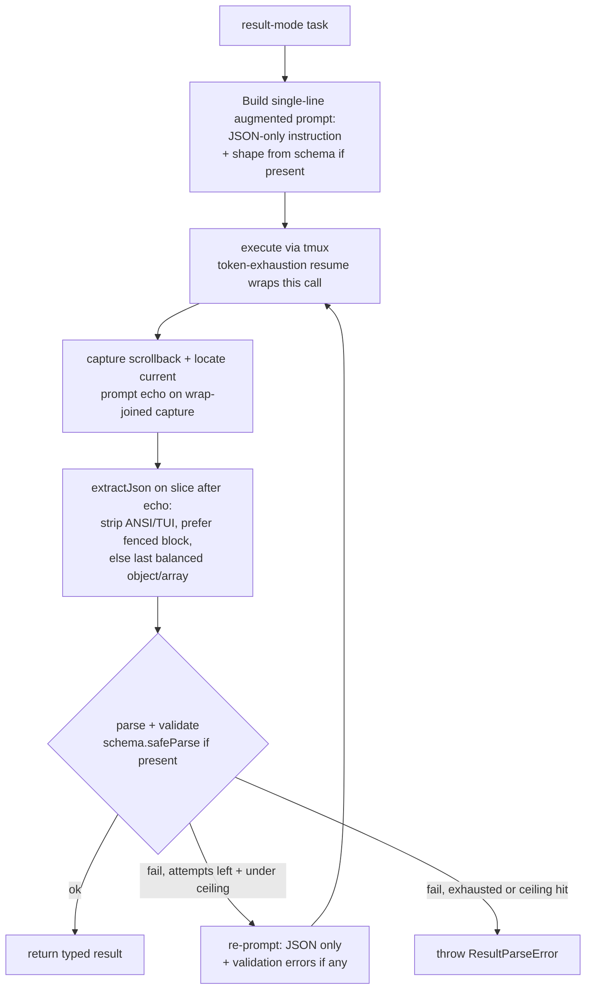

# feat: Integration test suite & reliable result-mode JSON

## Summary

Add a locally-gated real tmux + Claude integration suite covering four scenarios (one-shot, plain text, JSON, controlled high-concurrency), and overhaul result mode so JSON is reliable end-to-end — the SDK coaxes JSON-only output, extracts it from the noisy pane, retries on failure (default 3), and optionally validates and types it against a user-supplied Zod schema. Extraction/retry/validation are factored into a pure module with fake-based unit tests so CI guards them, while the real chain runs only on explicit opt-in. No bundled production dependency is added.

---

## Problem Frame

The integration layer is a stub: `test/integration/real-tmux.skip-safe.test.ts` only checks that `tmux` and `claude` are on `$PATH`. All real coverage runs through `FakeTmux` / `FakeClaude`, which return clean, pre-shaped data and therefore hide the class of bugs only the real adapter exhibits.

Result mode is the sharpest example. `parseResultIfNeeded` (`src/sdk.ts:530`) runs `JSON.parse` on the output from `RealTmuxAdapter.execute` (`src/tmux-adapter.ts:74`), and that output is the entire captured pane (TUI chrome, prompt echo, status lines like `✻ Baked`). Parsing that blob almost always throws `ResultParseError`. The fakes feed a clean `result`, so unit tests stay green while the real path cannot return JSON at all (see origin: `docs/brainstorms/2026-06-14-integration-examples-and-json-result-requirements.md`).

Two gaps follow: adapter-only failures ship silently without real integration tests, and the JSON scenario cannot pass even once those tests exist until the SDK owns JSON handling. This plan closes both, and adds an optional Zod layer so callers can enforce and type the shape they expect.

---

## Requirements

### Integration test suite

R1. Replace the availability-only stub with real end-to-end tests under `test/integration/` that drive real tmux + real Claude and assert behavior (origin R1).

R2. Gate behind explicit opt-in: a dedicated `pnpm test:integration` command plus a `RUN_INTEGRATION=1` env flag. The default `pnpm test` stays fast, fake-only, and never invokes Claude (origin R2).

R3. Remain skip-safe under opt-in: skip cleanly when `tmux` or the Claude CLI is unavailable (origin R3).

R4. one-shot scenario — `runOneShot(prompt)` returns a non-empty text `.output` (origin R4).

R5. plain-text scenario — `runTask({ mode: "oneshot" })` returns text via `.output`; full-API path, distinct from R4's shortcut (origin R5).

R6. JSON scenario — `runTask({ mode: "result", schema })` returns a parsed, schema-validated object; assert shape and a computable known value (origin R6).

R7. controlled-concurrency scenario — with `poolSize: 3` and 10 tasks submitted at once, peak concurrent running is exactly 3 and all 10 succeed (origin R7).

R8. Each test isolates its tmux sessions (unique `sessionPrefix`) and tears them down via `cleanup()`; per-test timeouts accommodate real-Claude latency (origin R8).

R9. Assertion discipline — constrained prompts with property/value assertions; no exact-equality on free-form model text (origin R9).

### Result-mode JSON reliability

R10. In result mode the SDK augments the prompt to force a single valid JSON value (no fences, no prose), transparently; the oneshot/text path is unaffected (origin R10).

R11. Before parsing, the SDK extracts JSON from the noisy pane capture: strip terminal/TUI chrome, prefer a fenced ```json block, otherwise the outermost balanced object/array (origin R11).

R12. On parse or validation failure the SDK re-prompts for JSON-only output — default 3 retries (`DEFAULT_JSON_REPAIR_ATTEMPTS`). Because repair attempts go through the full execute path (which itself may token-resume), a hard ceiling bounds total executions per result task (see KTD3); exhausting retries raises `ResultParseError` (origin R12).

R13. Result mode succeeds end-to-end against `RealTmuxAdapter`, closing the current breakage described in the Problem Frame.

### Optional Zod schema validation

R14. `runTask({ mode: "result", schema })` accepts an optional Zod schema. Absent → generic JSON behavior (R10–R12 with an "is valid JSON" check). Present → the schema drives prompt, validation, and typing (origin R13).

R15. When present, the schema does triple duty: shapes the JSON-only prompt, enforces the parsed result at runtime (`safeParse`), and types the return — inferred through the structural `SchemaLike<T>` interface (KTD7) so a Zod schema's type flows through without a zod reference in the published types (origin R14).

R16. When schema validation fails, the repair re-prompt (R12) includes the specific validation errors so the next attempt is corrective (origin R15).

R17. Zod is a peer/optional dependency, never bundled and never referenced in the published `.d.ts`; the no-schema path requires no Zod at runtime or typecheck, so a default install keeps zero production dependencies — verified by typechecking a consumer that has not installed zod (origin R16).

### Coverage & documentation

R18. Fake-based unit tests cover the new pure logic — extraction over recorded noisy pane samples, retry control flow (fail-then-succeed, fail-through-to-error), and schema validation (valid/invalid payloads) — runnable in CI without tmux or Claude (origin R17).

R19. The README, the result-mode example, and the scenario matrix reflect the new optional `schema` API and the `test:integration` command.

---

## Key Technical Decisions

- KTD1. **Extraction and repair live in a pure module (`src/json-result.ts`); orchestration stays in `src/sdk.ts`.** A pure `extractJson(raw) → string | undefined` plus an instruction builder is directly unit-testable in CI (serving the two-layer goal) and keeps the `TmuxAdapter` interface unchanged, so the same parse path runs for both fake and real adapters. The retry loop and schema validation are orchestrated in `sdk.ts` around the existing result path. Putting extraction in the adapter was rejected — the fake path would never exercise it, defeating R18.

- KTD2. **Zero-dependency is preserved at runtime AND in the published types.** Two leaks are closed: (1) no static runtime `import "zod"` — validation duck-types the passed schema's `safeParse`, and the no-schema path touches no validator at all; (2) the public type surface references a local structural validator interface (see KTD7), not `z.infer`/zod types, so the generated `dist/*.d.ts` carries no `import("zod")`. Without (2), a consumer who installs the SDK but not `zod` hits `TS2307` even on the no-schema path. `zod` is a `devDependency` (tests) and an optional `peerDependency` (`peerDependenciesMeta.zod.optional = true`); any schema introspection used for prompt-shaping happens only when a schema is present, so a default install bundles nothing.

- KTD3. **JSON-repair retry is a distinct loop from token-exhaustion resume, with a hard execution ceiling.** The existing `executeWithResume` (`src/sdk.ts:456`) handles token exhaustion by re-prompting `"continue"`; the new repair loop wraps extract+validate and re-prompts with a JSON-repair instruction (plus validation errors when a schema is present). Because each repair attempt goes through the full execute path, the two loops compound: the unbounded worst case is `(1 + resumeAttempts) × (1 + DEFAULT_JSON_REPAIR_ATTEMPTS)` tmux executions — ≈8× at defaults (`resumeAttempts=1`), and more if a caller raises `resumeAttempts`. To keep latency bounded independent of `resumeAttempts`, the result path enforces a single hard ceiling on total executions per result task. Repair count is a fixed `DEFAULT_JSON_REPAIR_ATTEMPTS = 3`, not user-configurable (origin decision).

- KTD4. **Concurrency is proven by a pre-warmed pool plus the running-peak.** `taskQueued` fires for every task on submission (`src/sdk.ts:192`), so a queued count does not discriminate. Exact peak is also racy if measured cold: slot startup is lazy and serialized (`acquireSlot` returns `undefined` while any slot is `starting`, `src/sdk.ts:329`), so a fast constrained task can finish before the third slot boots and the peak reads 2. The test therefore pre-warms all `poolSize` slots (submit `poolSize` priming tasks, await an idle pool) before the 10-task burst, then tracks `taskStarted`/`taskCompleted` into a live counter and asserts the peak is exactly 3 and never exceeds 3. `peak <= 3` is the always-true invariant; all 10 succeeding with peak 3 implies queuing occurred.

- KTD5. **Integration tests are isolated by a second vitest config.** The default `vitest.config.ts` excludes `test/integration/**` (keeping it fast and its 80% coverage thresholds meaningful). A new `vitest.integration.config.ts` includes only `test/integration/**`, disables coverage thresholds, and sets long `testTimeout`/`hookTimeout`. The `test:integration` script sets `RUN_INTEGRATION=1`; an in-file `skipIf` double-guards so the suite self-skips if run without the flag or without tmux/claude.

- KTD6. **Result-mode capture reads scrollback but scopes extraction to the current task.** `capturePane` uses `tmux capture-pane -p` (`src/tmux-adapter.ts:137`), which captures only the visible screen — a long JSON result is truncated before extraction sees it — so result-mode completion captures with scrollback (`-S -`). But pool slots keep one Claude alive across tasks (`executeTask` only starts Claude when `!slot.claudeRunning`, `src/sdk.ts:409`), so scrollback accumulates prior tasks' JSON. Extraction must be scoped to the current answer: slice the capture forward from the LAST occurrence of the current prompt echo (the adapter already locates it via `lastIndexOf(prompt)`), exclude any shape example echoed in the prompt, and when multiple balanced values remain prefer the last — otherwise the outermost-balanced scan can return a stale or echoed object that still passes schema validation. Visible-only capture stays for startup/readiness.

- KTD7. **Type the public `schema` against a local structural validator interface; Zod is the blessed validator.** The public surface declares a minimal `SchemaLike<T>` (a `safeParse(input) => { success: true; data: T } | { success: false; error: ... }`) and infers the result type from it — a Zod schema satisfies it structurally and `T` flows through, but no zod type is referenced in the published `.d.ts` (KTD2). This adopts the cheap Standard-Schema-style generalization now rather than later, because it is what closes the `.d.ts` leak; Zod stays the documented and tested validator and the only one prompt-shaping introspects.

- KTD8. **Result-mode prompt delivery and completion detection are wrapping- and scroll-safe.** `execute` sends the whole prompt with one `send-keys ... prompt Enter` (`src/tmux-adapter.ts:82`), so the augmented instruction and any serialized validation errors MUST be single-line — an embedded newline is received as Enter and submits a fragment. Completion detection also cannot rely on `output.includes(rawPrompt)` (`waitForCompletion`, `src/tmux-adapter.ts:193`): the longer result-mode prompt wraps, and for multi-screen answers the prompt echo scrolls off the visible pane, so the match silently degrades to the 5s stability timeout (and can return truncated JSON). Result mode matches the prompt echo on a wrap-joined capture (`capture-pane -pJ`) or via a unique per-task sentinel rather than the raw-prompt substring.

---

## High-Level Technical Design

### Result-mode JSON pipeline (R10–R16)

The prose requirements remain authoritative; the diagram is an on-ramp.



### Two-layer test topology

| Layer | What it exercises | Where | Runs in CI? | Gate |
|---|---|---|---|---|
| Unit (fake) | `extractJson` over recorded noisy samples; retry control flow; schema validation | `test/*.test.ts` via `FakeTmux`/`FakeClaude` | Yes | default `pnpm test` |
| Integration (real) | one-shot, plain text, JSON, concurrency against real tmux + Claude | `test/integration/**` | No (local only) | `pnpm test:integration` + `RUN_INTEGRATION=1` |

---

## Implementation Units

### U1. Test gating infrastructure

- **Goal:** A separate, opt-in integration test runner that is excluded from the default test pass and self-skips when not explicitly enabled.
- **Requirements:** R2, R3.
- **Dependencies:** none.
- **Files:** `vitest.config.ts` (add `test.exclude` for `test/integration/**`), `vitest.integration.config.ts` (new — include only `test/integration/**`, no coverage thresholds, long `testTimeout`/`hookTimeout`), `package.json` (add `test:integration` script setting `RUN_INTEGRATION=1`), `test/integration/support.ts` (new — `describeIntegration` wrapper that skips unless `RUN_INTEGRATION` is set and both `tmux` and `claude` resolve via `command -v`), `test/integration/real-tmux.skip-safe.test.ts` (fold its availability check into `support.ts`; replace with a minimal harness-boot smoke or remove).
- **Approach:** Reuse the existing `hasCommand` pattern from the current stub for availability detection. `describeIntegration(name, fn)` resolves the gate once and routes to `describe.skip` when closed, so every scenario file shares one guard. Keep the default config's coverage thresholds untouched.
- **Patterns to follow:** existing `hasCommand` in `test/integration/real-tmux.skip-safe.test.ts`; existing `vitest.config.ts` shape.
- **Test scenarios:** Test expectation: none — runner config and scaffolding. Verify behaviorally in Verification below.
- **Verification:** `pnpm test` collects zero files under `test/integration/`; `pnpm test:integration` without tmux/claude present skips cleanly (no failures); with the flag unset, the integration config self-skips.

### U2. Pure JSON extraction + repair-instruction module

- **Goal:** A dependency-free module that builds the JSON-only prompt instruction and extracts a JSON value from noisy terminal output.
- **Requirements:** R10 (instruction builder), R11 (extraction), R18 (unit-tested).
- **Dependencies:** none.
- **Files:** `src/json-result.ts` (new), `test/json-result.test.ts` (new).
- **Approach:** Export `buildResultInstruction(opts?)` returning a **single-line** JSON-only suffix (no embedded newlines — KTD8; when a shape description is supplied, a single-line shape hint), and `extractJson(raw): string | undefined` that strips ANSI escape sequences and known TUI chrome, prefers a fenced ```json block, and otherwise scans for balanced `{...}`/`[...]` values, returning the **last** balanced value when several are present (KTD6). Keep parsing/validation out of this module — orchestration owns `JSON.parse` + schema — so the function stays pure and reusable. No `zod` import here.
- **Patterns to follow:** zero-dependency utility style in `src/`; typed errors live in `src/errors.ts` (this module returns `undefined` rather than throwing — the caller raises `ResultParseError`).
- **Test scenarios:**
  - Covers R11. Clean JSON object string → extracted unchanged and parses.
  - Covers R11. JSON wrapped in a fenced ```json block amid prose → fenced content extracted.
  - Covers R11. JSON embedded in a captured pane with TUI chrome, prompt echo, and an `✻ Baked` status line → object extracted, chrome discarded.
  - Covers R11. ANSI color escape codes around the JSON → stripped before extraction.
  - Covers R11. Outermost-balanced selection: trailing log line after a complete object → only the object returned; nested braces inside strings do not break balancing.
  - Covers R11. No JSON present (plain prose) → returns `undefined`.
  - Covers R11. Array top-level value → extracted.
  - Covers R11, KTD6. Capture containing a prior task's JSON, then the current prompt echo (with a shape example), then the current answer → the current answer is returned, not the stale or echoed object.
  - Covers R11, KTD6. Multiple top-level JSON values in one capture → the last balanced value is returned.
  - Covers R10, KTD8. `buildResultInstruction()` returns a non-empty JSON-only directive containing no newline characters; with a shape description, the directive includes it on one line.
- **Verification:** `pnpm test` passes the new file; `src/json-result.ts` stays ≥80% covered; no new production dependency in `package.json`.

### U3. Result-mode orchestration in `sdk.ts`

- **Goal:** Wire prompt augmentation, extraction, and the repair-retry loop into the result path so result mode returns parsed JSON or a typed error.
- **Requirements:** R10, R11, R12, R13.
- **Dependencies:** U2.
- **Files:** `src/sdk.ts` (augment the result-mode prompt in `toRequest`; replace `parseResultIfNeeded` body to use `extractJson`; add the repair loop around execute+extract in the result path), `src/json-result.ts` (consume helpers), `test/result-modes.test.ts` (extend), `test/json-repair.test.ts` (new — repair loop via `FakeTmux`).
- **Approach:** When `mode === "result"`, `toRequest` appends a single-line `buildResultInstruction()` to the prompt (KTD8); oneshot/text requests are unchanged. After execute, run `extractJson` on the current-task-scoped output and `JSON.parse`; on failure, re-prompt (a new execute carrying a single-line repair instruction) up to `DEFAULT_JSON_REPAIR_ATTEMPTS` times before throwing `ResultParseError`. Enforce a hard ceiling on total executions per result task so the repair loop and `executeWithResume`'s token-resume cannot compound without bound (KTD3); keep the repair loop separate from `executeWithResume`; the pre-parsed `result.result` fast path (fake adapter) is preserved.
- **Execution note:** Add a failing test for "noisy output extracts to parsed result" first — it pins the contract the new parse path must satisfy and currently fails against the old `JSON.parse(rawPane)` behavior.
- **Patterns to follow:** existing `executeTask`/`executeWithResume`/`parseResultIfNeeded` in `src/sdk.ts`; `FakeClaude.enqueue` behavior sequencing in `test/result-modes.test.ts`.
- **Test scenarios:**
  - Covers R10. result-mode execution sends a prompt that includes the JSON-only instruction; oneshot execution does not (assert via `FakeClaude.executions`).
  - Covers R11, R13. First reply is a noisy pane string containing a JSON object → SDK returns the parsed object.
  - Covers AE2. First reply fails extraction, second reply is valid JSON → SDK returns the parsed object after one retry (assert execution count).
  - Covers AE3. All 4 attempts fail → `ResultParseError`; assert exactly 4 executions.
  - Covers R12. Happy path (first reply valid) performs exactly 1 execution (no needless retry).
  - Covers KTD3. A result task that both token-exhausts and fails parse does not exceed the execution ceiling (assert total `execute` calls ≤ ceiling).
  - Regression. oneshot mode output is returned verbatim with `result: undefined`; pre-parsed `result` pass-through still works.
- **Verification:** `pnpm test` green including updated `result-modes.test.ts`; `sdk.ts` coverage holds ≥80%.

### U4. Optional Zod schema validation

- **Goal:** Accept an optional Zod schema on result-mode tasks that validates, types, and sharpens the repair loop — without adding a bundled dependency.
- **Requirements:** R14, R15, R16, R17.
- **Dependencies:** U2, U3.
- **Files:** `src/types.ts` (add a local `SchemaLike<T>` interface; add `schema?: SchemaLike<T>` to `RunTaskOptions`; infer `runTask`'s return type from it), `src/sdk.ts` (thread the schema into validation and the repair re-prompt), `src/json-result.ts` (validation wrapper that duck-types `safeParse`; optional schema→shape description), `package.json` (`zod` as `devDependency` + optional `peerDependency`), `test/json-schema.test.ts` (new), `test/public-api-types.test.ts` (extend with a type-level inference assertion using a real Zod schema).
- **Approach:** Type the optional `schema` against the local `SchemaLike<T>` interface and infer `TaskResult<T>` when supplied (KTD7) — no `z.infer`/zod reference in the public types. At runtime, when `schema` is present, first assert `typeof schema.safeParse === "function"` and throw a typed error if not (never silently skip validation); then call `schema.safeParse(parsed)` and, on failure, format issues from the result's `{ success: false, error }` shape (not zod-version-specific internals) into the repair re-prompt (R16) and retry per the U3 loop. No schema → unchanged generic behavior. Never statically import `zod`; any introspection for the prompt shape is dynamic and only runs when a schema is present (KTD2).
- **Patterns to follow:** `readonly` option interfaces in `src/types.ts`; generic `runTask<TResult>` signature already present.
- **Test scenarios:**
  - Covers R14, R15. Schema present (a real Zod schema), first reply valid and matching → typed result returned; the inferred return type is exercised in `public-api-types.test.ts`.
  - Covers R16. Schema present, first reply parses as JSON but violates the schema, second reply matches → returned after retry; assert the repair re-prompt carried the validation error text.
  - Covers KTD7, R17. A non-Zod object exposing a conforming `safeParse` validates and infers `T` correctly (structural typing, no zod dependency).
  - Covers A6 finding. Schema present but lacking a `safeParse` function → typed error, never a silently-unvalidated result.
  - Covers AE3. Schema present, all attempts violate the schema → `ResultParseError` at the execution ceiling.
  - Covers R14. Schema absent → only JSON validity is checked; non-schema result returns untyped `unknown`.
- **Verification:** `pnpm test` and `pnpm run typecheck` green; built `dist/*.js` contains no bundled `zod` AND `dist/*.d.ts` contains no `import("zod")`/zod type reference; a scratch consumer that has NOT installed `zod` typechecks against the published types on the no-schema path; `package.json` shows `zod` only under `devDependencies` + optional `peerDependencies`.

### U5. RealTmuxAdapter result-mode capture and completion

- **Goal:** Capture the full current-task JSON answer (even multi-screen) and detect completion reliably, without picking up stale scrollback from a reused slot.
- **Requirements:** R13 (supports), R11 (supports).
- **Dependencies:** none (independent adapter change; consumed by U8).
- **Files:** `src/tmux-adapter.ts`.
- **Approach:** For the result-completion read path, capture with scrollback (`tmux capture-pane -p -S -`) and detect completion against a wrap-joined capture (`-pJ`) or a unique per-task sentinel rather than `output.includes(rawPrompt)` — the longer/wrapped result prompt and multi-screen answers otherwise defeat the substring match and degrade to the stability timeout (KTD8). Return the slice from the LAST current-prompt-echo occurrence forward so reused-slot scrollback can't leak a prior task's JSON (KTD6); leave the visible-only `capturePane` for startup/readiness. Keep changes behind the result path.
- **Patterns to follow:** existing `capturePane`, `waitForCompletion`, and the `lastIndexOf(prompt)` use in `isResponseComplete` in `src/tmux-adapter.ts`; the file is wrapped in `/* v8 ignore */` (real-only, not unit-covered).
- **Execution note:** Capture a real result-mode pane sample early and seed U2's fixtures from it before finalizing extraction.
- **Test scenarios:** Test expectation: none in unit layer (adapter is real-only). Exercised by U8 (including a multi-screen result and a two-result-tasks-in-one-slot case); the extraction-scoping logic itself is unit-tested in U2 via recorded samples.
- **Verification:** U8 passes with a multi-screen JSON result and with two sequential result tasks on one reused slot each returning their own answer; readiness/startup detection unaffected (U6 still starts cleanly).

### U6. Integration scenarios — one-shot + plain text

- **Goal:** Prove the simplest real-chain paths return text.
- **Requirements:** R4, R5, R8, R9.
- **Dependencies:** U1.
- **Files:** `test/integration/text.integration.test.ts` (new).
- **Approach:** Use `describeIntegration`. one-shot: `runOneShot` with a constrained prompt (e.g. "Reply with exactly: OK"); assert `.output` is non-empty and contains the known token. plain text: `runTask({ mode: "oneshot" })` with the same discipline. Unique `sessionPrefix` per test; `cleanup()` in a `finally`/`afterEach`. Long per-test timeout.
- **Patterns to follow:** `AgentTmuxSdk` construction in `examples/01-basic-oneshot.ts` and `examples/05-process-pool.ts`; assertion discipline R9.
- **Test scenarios:**
  - Covers R4, AE5. `runOneShot` → non-empty `.output` containing the known token.
  - Covers R5. `runTask({ mode: "oneshot" })` → `.output` text via the full API.
  - Covers R8. Sessions are torn down (no leaked tmux sessions after the run).
- **Verification:** `pnpm test:integration` runs these against real tmux+Claude and they pass; `pnpm test` does not collect them.

### U7. Integration scenario — controlled high-concurrency

- **Goal:** Prove the pool caps concurrency at `poolSize` under load.
- **Requirements:** R7, R8.
- **Dependencies:** U1.
- **Files:** `test/integration/concurrency.integration.test.ts` (new).
- **Approach:** `poolSize: 3`; pre-warm by submitting 3 priming tasks and awaiting an idle pool, then submit 10 `runOneShot` calls at once. Track a live running counter from `taskStarted` (+1) and `taskCompleted`/`taskFailed` (−1), recording the peak. Assert peak `=== 3`, the counter never exceeds 3, and all 10 resolve successfully. Pre-warming removes the serialized-cold-start race that could otherwise let the peak read 2 (KTD4). Generous timeout (13 real calls across 3 slots).
- **Patterns to follow:** event subscription in `examples/10-lifecycle-events.ts`; pool usage in `examples/05-process-pool.ts`.
- **Test scenarios:**
  - Covers R7, AE1. Pre-warmed pool, 10 tasks / poolSize 3 → peak running is exactly 3, never exceeds 3, all 10 succeed.
  - Covers R8. All processes are cleaned up after the run.
- **Verification:** `pnpm test:integration` passes; with pre-warming the peak-3 assertion is deterministic across repeated local runs.

### U8. Integration scenario — JSON result with schema

- **Goal:** Prove the full result-mode overhaul works end-to-end against real Claude.
- **Requirements:** R6, R13, R8, R9.
- **Dependencies:** U1, U3, U4, U5.
- **Files:** `test/integration/json-result.integration.test.ts` (new).
- **Approach:** `runTask({ mode: "result", schema })` with a Zod schema for a small known shape and a constrained prompt whose answer is computable (e.g. a `sum` field that must equal 4). Assert the result validates against the schema and the known value is correct. Include one case whose JSON exceeds a single screen (exercises U5 capture/completion) and one that runs two result tasks on the same pooled slot (exercises current-task extraction scoping, KTD6 — each must return its own answer).
- **Patterns to follow:** `examples/06-result-mode.ts` (updated in U9); schema usage from U4.
- **Test scenarios:**
  - Covers R6, R13. result-mode task with schema → parsed object validating against the schema, with the known computable value correct.
  - Covers R11 (real). A multi-screen JSON result is captured in full and extracted (depends on U5).
  - Covers KTD6 (real). Two result tasks on one reused slot each return their own answer (no stale-scrollback bleed).
  - Covers R9. Assertions are shape/value-based, not exact-text.
- **Verification:** `pnpm test:integration` passes; this test fails if reverted onto the pre-U3 SDK (confirming it exercises the new path).

### U9. Docs — README, result-mode example, scenario matrix

- **Goal:** Keep public docs consistent with the new optional `schema` API and the integration command.
- **Requirements:** R19.
- **Dependencies:** U3, U4.
- **Files:** `README.md`, `README_zh.md`, `examples/06-result-mode.ts`, `docs/scenario-matrix.md`, `docs/scenario-matrix_zh.md`.
- **Approach:** Update the README result-mode/quick-start to show `runTask({ mode: "result", schema })` (no hand-written JSON instructions), note `zod` as an optional peer dependency, and document `pnpm test:integration` + `RUN_INTEGRATION=1`. Rewrite `examples/06-result-mode.ts` to use a Zod schema instead of embedding JSON instructions in the prompt. Update the scenario matrix: revise the INT-01 row (now a gated suite) and add rows for the new integration scenarios and the result-mode JSON/extraction/repair/schema coverage.
- **Patterns to follow:** existing README API table and the `docs/scenario-matrix.md` row format.
- **Test scenarios:** Test expectation: none — documentation. `examples/06-result-mode.ts` must typecheck under `examples/tsconfig.json`.
- **Verification:** example compiles; README and both scenario-matrix files reflect the shipped behavior; no stale "write JSON in your prompt" guidance remains.

---

## Acceptance Examples

AE1. **Covers R7 (U7).** **Given** a pre-warmed pool of 3 slots and 10 tasks submitted at once, **When** dispatched, **Then** (tracked via task lifecycle events) the running count never exceeds 3, the peak reaches exactly 3, and all 10 complete successfully — a peak of 3 with 10 submitted tasks confirms queuing occurred.

AE2. **Covers R12 (U3).** **Given** the first reply fails extraction or validation, **When** the SDK retries, **Then** it re-prompts (up to 3 times) and returns the validated object as soon as any attempt yields valid JSON.

AE3. **Covers R12, R16 (U3, U4).** **Given** every repair attempt (up to the execution ceiling) fails to produce extractable/valid JSON, **When** retries are exhausted, **Then** the SDK raises `ResultParseError`.

AE4. **Covers R14, R15 (U4).** **Given** `mode: "result"` with a schema, **Then** the result is runtime-validated and typed via `z.infer`. **Given** no schema, **Then** the SDK only checks valid JSON and returns it untyped.

AE5. **Covers R2, R3 (U1, U6).** **Given** the opt-in flag is unset, **When** `pnpm test` runs, **Then** integration tests do not execute. **Given** the flag is set but tmux/claude are absent, **Then** they skip cleanly rather than fail.

---

## Risks & Dependencies

- **Extraction robustness against real Claude TUI output** is the central risk — the noisy-pane shape is what the fakes can't model. Mitigation: U8 exercises it for real; capture a real pane sample early and seed U2's fixtures from it; expect to iterate `extractJson` against real captures.
- **Capture truncation for very long JSON** — addressed by U5 (scrollback capture); residual risk for extreme outputs that exceed even scrollback limits.
- **Retry latency** — repair retries compound with token-resume, so a stubborn result task can reach `(1+resumeAttempts)×(1+repairAttempts)` executions (≈8× at defaults). Bounded by the hard execution ceiling (KTD3); integration timeouts are sized to the ceiling, not to 4×.
- **Zod leakage (runtime and types)** — a stray static `import "zod"` would bundle it, and typing against `z.infer` would leak `import("zod")` into the published `.d.ts` and break the no-zod consumer typecheck. Mitigation: duck-typed `safeParse` for runtime, structural `SchemaLike` for types (KTD2/KTD7); U4 verifies both `dist/*.js` and `dist/*.d.ts` plus a no-zod consumer typecheck.
- **Prompt delivery and completion detection** — a multi-line augmented/repair instruction would submit fragments via `send-keys`, and a wrapped or scrolled-off prompt echo defeats substring-based completion. Mitigation: single-line instructions and wrap-joined/sentinel completion in result mode (KTD8); validate against a real captured pane early.
- **Stale scrollback in reused slots** — extracting from full scrollback could return a prior task's JSON that still validates. Mitigation: scope extraction to the last current-prompt-echo occurrence (KTD6); U8 covers two sequential result tasks on one slot.
- **Non-determinism / flakiness** — mitigated by constrained prompts, shape/value assertions, and long timeouts; integration suite is local-only, so flakiness never blocks CI.
- **Dependency:** running U6–U8 requires a locally authenticated Claude CLI and `tmux` in `$PATH`. CI relies on the U2–U4 fake unit layer instead.

---

## Alternatives Considered

- **Extraction location.** Pure module (chosen) vs. inside `RealTmuxAdapter` (rejected: the fake path would never run it, defeating CI coverage) vs. inline in `parseResultIfNeeded` (rejected: mixes string logic into orchestration and is harder to unit-test in isolation).
- **Validator typing.** Zod-specific (chosen, KTD7) vs. a generic Standard Schema interface (deferred: broader validator support but more surface; runtime duck-typing keeps later generalization cheap).
- **Integration gating.** Separate vitest config (chosen, KTD5) vs. a single config with env-only gating (rejected: integration-only runs would fail the 80% coverage thresholds and long timeouts can't be scoped cleanly).

---

## Scope Boundaries

### In scope

The four integration scenarios, the result-mode JSON overhaul, optional Zod validation, the fake-based unit layer, the scrollback capture change, and the doc/example updates.

### Deferred for later (origin)

- Making the repair retry count configurable (fixed at 3 now).
- Multi-validator support via the Standard Schema interface.
- Structured/JSON streaming (streaming stays plain-text).
- Running the real-Claude integration suite in CI.

### Outside the product's identity (origin)

- Bundling Zod (or any validator) as a production dependency.
- Changing the tmux execution / container-consumer model.

---

## Open Questions

Deferred to implementation:

- Exact repair re-prompt wording and how Zod validation issues are formatted into it.
- Exact prompt-shaping mechanism from a schema, and the zod version it implies (zod v4's `z.toJSONSchema` vs. an extra `zod-to-json-schema` package vs. a lightweight description walk) — must stay single-line (KTD8) and avoid pinning a zod major version in a way that could break `safeParse`/error-shape assumptions.
- Cross-platform env setting for the `test:integration` script (inline `RUN_INTEGRATION=1` works on macOS/Linux; Windows users set it manually unless a dependency-free shim is added).
- Whether readiness detection needs tuning once result-mode capture includes scrollback.

---

## Sources / Research

- Origin requirements: `docs/brainstorms/2026-06-14-integration-examples-and-json-result-requirements.md`.
- `src/sdk.ts` — `parseResultIfNeeded` (530), `executeTask`/`executeWithResume` (400, 456), `runTask` `taskQueued` emit (177).
- `src/tmux-adapter.ts` — `execute`/`waitForCompletion` (74, 182), `capturePane` visible-only (137).
- `src/types.ts` — `RunTaskOptions`, `TaskResult`, `SdkEventMap`.
- `test/fakes/fake-claude.ts` — behavior/`output`/`result` shape used to feed noisy samples and sequence retries.
- `test/result-modes.test.ts` — existing mode test patterns.
- `vitest.config.ts` (coverage thresholds), `package.json` (zero-dep, scripts), `tsup.config.ts` (bundle entry).
